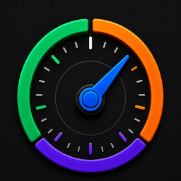
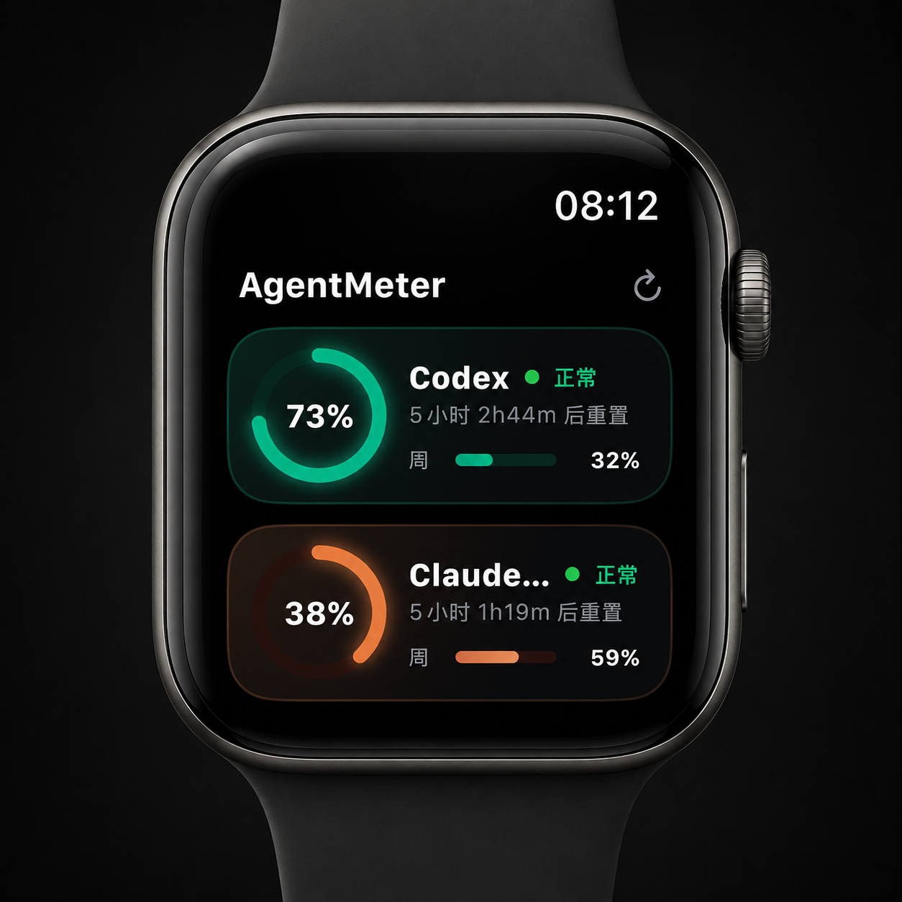
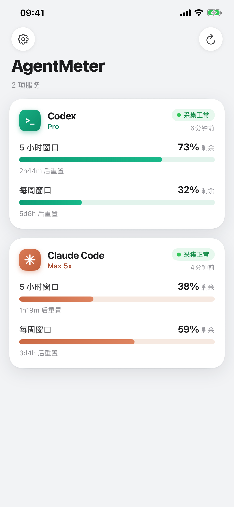
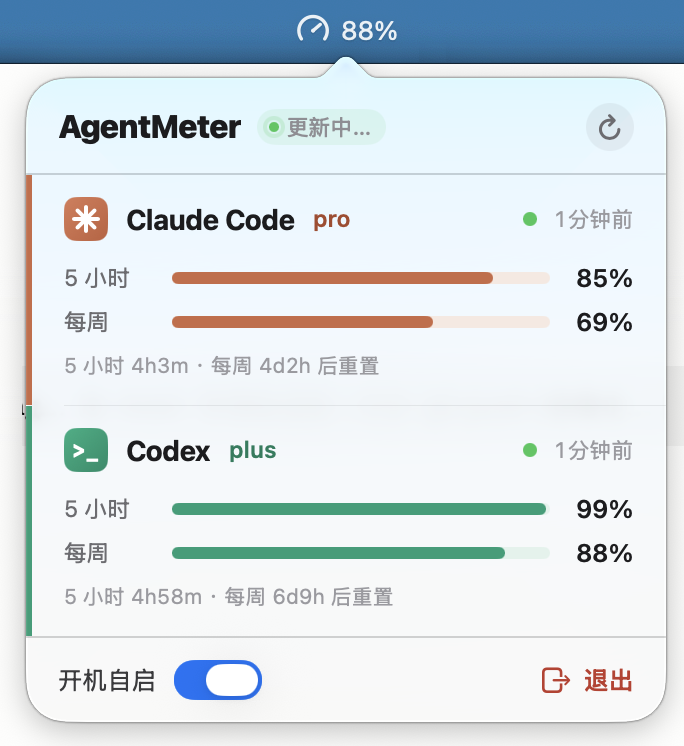

# AgentMeter

### AI quota status under your watch.

**English** · [中文](README.zh-CN.md)

---

Coding agents keep burning quota while you're away from the keyboard. **AgentMeter** puts your Claude Code and Codex quota where you can check it in two seconds — your Apple Watch face. See how much is left in the current **5‑hour window** and the **weekly window**, plus when each one resets — without digging through a terminal.

## Download

**[⬇️ Download AgentMeter for Mac (.dmg)](https://github.com/dothinkerlab/AgentMeter/releases/latest/download/AgentMeter.dmg)**

The Mac app is Developer ID–signed and notarized by Apple — just open it. Drag **AgentMeter.app** into your Applications folder; on first launch it asks permission to read your local Claude Code and Codex credentials. See all versions on the [Releases page](https://github.com/dothinkerlab/AgentMeter/releases).

> The iPhone + Apple Watch app ships through the App Store *(coming soon)*. The Mac app is distributed only as this notarized DMG, because it needs to read those tools' Keychain items and therefore can't run in the App Store sandbox.

## Screenshots

<table>
  <tr>
    <td align="center" valign="center"></td>
    <td align="center" valign="center"></td>
    <td align="center" valign="center"></td>
  </tr>
  <tr>
    <td align="center"><b>Apple Watch</b></td>
    <td align="center"><b>iPhone</b></td>
    <td align="center"><b>Mac menu bar</b></td>
  </tr>
</table>

## How it works

1. A small **Mac menu‑bar companion** reads the Claude Code and Codex credentials already on your machine and uses them, on your Mac, to query each tool's quota.
2. It syncs **cleaned quota snapshots** through *your own* private iCloud database — no account or server of ours involved.
3. Your **Apple Watch** (and iPhone) show the remaining percentage and reset time at a glance.

The watch and iPhone only ever see cleaned snapshots — they never connect to Anthropic or OpenAI.

## Privacy

- Your OAuth token stays in your **Mac Keychain**. AgentMeter uses it only on your Mac to call the official Claude Code / Codex endpoints — it is **never sent to us** and **never written to iCloud**.
- Only **cleaned quota snapshots** (numbers + reset times) sync, and only through **your private iCloud**.
- When data can't be refreshed, AgentMeter clearly marks it **stale** instead of showing a misleading value.

## Requirements

- **Mac companion app:** macOS 13 or later (notarized DMG above).
- **iPhone + Apple Watch app:** App Store *(coming soon)*.
- A Claude Code or Codex subscription signed in on your Mac.

---

AgentMeter tracks **Claude Code** and **Codex** today; more tools are planned.

© 2026 dothinker lab · [Releases](https://github.com/dothinkerlab/AgentMeter/releases)

---

## Disclaimer

AgentMeter reads quota data from **unofficial, undocumented** endpoints of Claude Code and Codex. They may change or stop working at any time, and using them may be subject to the respective providers' terms of service — **use at your own risk**.

AgentMeter is an independent project and is **not affiliated with, endorsed by, or sponsored by** Anthropic or OpenAI. "Claude" and "Claude Code" are trademarks of Anthropic; "Codex" and "ChatGPT" are trademarks of OpenAI; "Apple Watch" is a trademark of Apple Inc. All trademarks belong to their respective owners.
