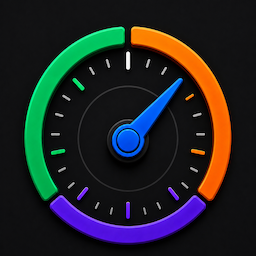
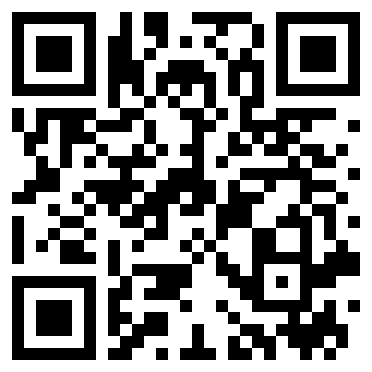
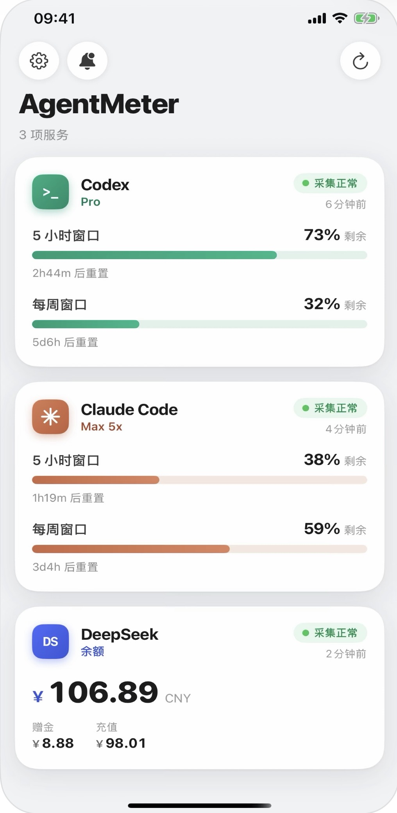
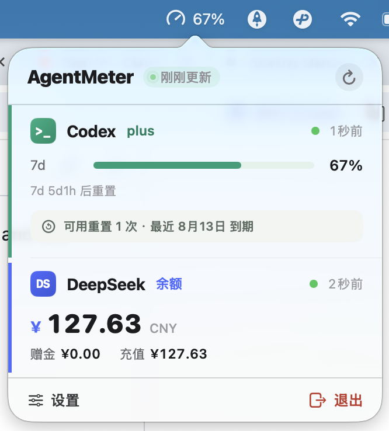
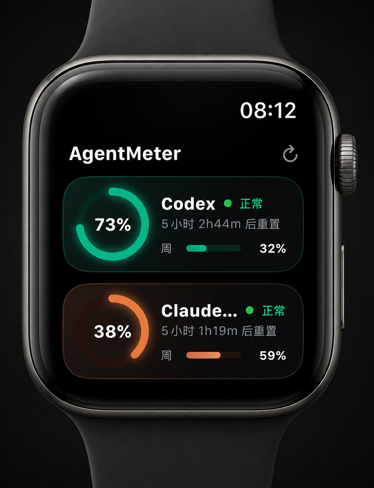

<div align="center">

# AgentMeter

### Keep your AI coding quota on your wrist.

**English** · [中文](README.zh-CN.md)



[](https://github.com/dothinkerlab/AgentMeter/releases/latest)

</div>

---

Coding agents can keep spending quota after you leave the keyboard. **AgentMeter** keeps coding-plan quota windows, reset times, and API billing status visible on your Apple Watch, iPhone, and Mac menu bar—without making you return to the terminal.

Track Claude Code, Codex, Kimi Code, GLM Coding Plan, and MiniMax Token Plan quota, alongside device-local billing data for DeepSeek, OpenRouter, xAI API, Kimi API, OpenAI API, and Anthropic API. AgentMeter shows the windows each provider actually reports, including short rolling windows, weekly limits, and other provider-specific periods.

## Download AgentMeter

| Platform | Get it |
| --- | --- |
| macOS companion | [Download the notarized DMG](https://github.com/dothinkerlab/AgentMeter/releases/latest/download/AgentMeter.dmg) |
| macOS via Homebrew | `brew install --cask dothinkerlab/tap/agentmeter` |
| iPhone + Apple Watch | [Download on the App Store](https://apps.apple.com/app/id6781480047) |

The Mac app is Developer ID-signed and notarized by Apple. Drag **AgentMeter.app** into your Applications folder; on first launch, it asks for permission to read the local Claude Code and Codex credentials already stored on your Mac. Previous builds are available on the [Releases page](https://github.com/dothinkerlab/AgentMeter/releases).

Homebrew users can install or upgrade the same notarized build with:

```sh
brew install --cask dothinkerlab/tap/agentmeter
```

The iPhone and Apple Watch app ships through the App Store:



> The Mac companion is distributed outside the App Store because it needs Keychain access to your local Claude Code and Codex credentials, which is not compatible with the App Store sandbox.

All features are free.

## At a Glance

- **Quota where you need it:** Apple Watch complications and app views, an iPhone status view, and a Mac menu-bar companion.
- **Provider-aware windows:** remaining quota, reset times, Codex reset credits, and expiry reminders using the periods reported by each coding plan.
- **Local API billing:** balances, limits, or daily/weekly/monthly costs where the provider API makes them available.
- **Full Mac controls:** searchable provider settings, credential and region controls, collection pause/resume, plus local visibility and ordering preferences.
- **Reliable status:** stale-data warnings instead of silently presenting old data, and optional 5-hour reset reminders when fresh data shows a depleted window.
- **Privacy-safe support:** export sanitized diagnostics and open a structured bug report without sharing credentials or raw logs.

## Supported Services

| Data | Providers | Configuration and collection | Display and sync |
| --- | --- | --- | --- |
| Coding-plan quota | Claude Code, Codex, Kimi Code, GLM Coding Plan, MiniMax Token Plan | Claude Code and Codex use existing CLI sign-ins on Mac. Other plans are configured independently on Mac or iPhone. | Cleaned quota snapshots can sync through your private CloudKit database to iPhone and Apple Watch. |
| Local API balance and billing | DeepSeek, OpenRouter, xAI API, Kimi API, OpenAI API, Anthropic API | Credentials are configured separately on each supported device and stay in its local Keychain. | Billing records never enter CloudKit. Mac shows its local data; iPhone can send only a sanitized display snapshot to its widgets and paired Apple Watch. |

OpenAI API and Anthropic API show organization-level developer API costs, not ChatGPT or Claude web/app subscription usage. xAI API billing requires a Management Key and Team ID.

## Screenshots

<table>
  <tr>
    <td align="center" valign="center"></td>
    <td align="center" valign="center"></td>
    <td align="center" valign="center"></td>
  </tr>
  <tr>
    <td align="center"><sub><b>iPhone</b></sub></td>
    <td align="center"><sub><b>Mac menu bar</b></sub></td>
    <td align="center"><sub><b>Apple Watch</b></sub></td>
  </tr>
</table>

## How it works

1. The **Mac menu-bar companion** reads your existing Claude Code and Codex credentials from the local Keychain. Kimi Code, GLM Coding Plan, and MiniMax Token Plan can be configured separately on Mac and iPhone.
2. Each device uses only its local credentials to query the corresponding provider.
3. Coding-plan collectors write only **cleaned quota snapshots** to your private iCloud database: tool and subscription tier, percentage windows and types, reset times, Codex reset-credit availability with grant/expiry timestamps, confidence, stale reason, collector device, source, and update time.
4. Your **Apple Watch** and **iPhone** read those snapshots from iCloud and display them at a glance.

Local API billing follows a separate path: credentials and billing records are never written to CloudKit. Your Apple Watch never receives provider tokens or connects directly to a provider. The iPhone connects only to providers you explicitly configure on that device, using credentials that remain in its local Keychain.

## Privacy

AgentMeter is designed around a local-token, private-iCloud sync model:

- OAuth tokens stay in your **Mac Keychain**.
- Tokens are used only by the Mac companion, on your Mac, to refresh quota data.
- Tokens are **never sent to us** and **never written to iCloud**.
- Manually entered coding-plan and billing credentials stay in the local Keychain with iCloud Keychain synchronization and encrypted-backup migration disabled.
- DeepSeek, OpenRouter, xAI API, Kimi API, OpenAI API, and Anthropic API billing records stay local and are never included in CloudKit quota snapshots.
- Synced CloudKit records contain only cleaned coding-plan state: tool and subscription tier; percentage windows, types, and reset times; Codex reset-credit availability with grant/expiry timestamps; confidence, stale reason, collector device, source, and update time. They never contain provider credentials or upstream reset-credit IDs.
- If data cannot be refreshed, AgentMeter marks it as **stale**.
- Sanitized diagnostics are generated only when you request an export. They use an explicit allowlist and omit tokens, API keys, Keychain values, device names, raw logs, raw provider payloads, and billing amounts.

## Troubleshooting and Bug Reports

If Mac, iPhone, and Apple Watch disagree, first compare the **updated time** shown on each affected device.

1. Export sanitized diagnostics from **Settings → About AgentMeter → Export Sanitized Diagnostics** on Mac, or **Settings → App Info** on iPhone.
2. Open the structured [Bug Report form](https://github.com/dothinkerlab/AgentMeter/issues/new?template=bug_report.yml).
3. Add reproduction steps, the updated time from each affected device, and the exported diagnostic file.

The diagnostic report includes the app version and build, OS version, coding-plan window and reset status, update times, local billing service status, and pending CloudKit writes. It does **not** include credentials, Keychain data, device names, raw logs, raw provider payloads, or billing amounts. Review screenshots and any text you add before submitting.

## Requirements

- macOS 13 or later for the Mac companion.
- iOS/watchOS app installed from the [App Store](https://apps.apple.com/app/id6781480047).
- iCloud enabled with the same Apple ID across your Mac, iPhone, and Apple Watch.
- Claude Code or Codex signed in on your Mac. Other coding plans and billing sources use credentials entered independently on each device; xAI API billing requires a Management Key and Team ID, while OpenAI API and Anthropic API costs require organization Admin API keys.

---

<div align="center">

Keep your AI coding quota visible across Mac, iPhone, and Apple Watch.

© 2026 dothinker lab · [Releases](https://github.com/dothinkerlab/AgentMeter/releases)

</div>

---

## Building from source

This repository contains the source for the macOS companion (`AgentMeterMac`) and shared core package (`AgentMeterCore`). The iPhone and Apple Watch app is distributed through the App Store and is not included in this repository.

Run the core test suite:

```sh
cd Packages/AgentMeterCore
swift test
```

Generate and open the Xcode project:

```sh
xcodegen generate
open AgentMeter.xcodeproj
```

The checked-in `DEVELOPMENT_TEAM` and iCloud container ID belong to the maintainer. If you fork the project, replace them with your own Apple Developer Team and CloudKit container in [`project.yml`](project.yml) and [`AgentMeterMac/AgentMeterMac.entitlements`](AgentMeterMac/AgentMeterMac.entitlements).

## Maintainer release validation

Every public Mac release must be validated end-to-end with the exact iPhone build
installed from TestFlight. Use the mandatory
[Mac + iPhone release checklist](docs/RELEASE_CHECKLIST.md), including CloudKit
Production schema review and testing the app installed from the final downloadable
DMG.

## License

[MIT](LICENSE.md) © 2026 dothinker lab.

---

## Disclaimer

AgentMeter reads quota data from **unofficial, undocumented** Claude Code and Codex endpoints. These endpoints may change or stop working at any time. Other integrations use their providers' APIs, which may also change. Using these services may be subject to each provider's terms of service. Use AgentMeter at your own risk.

AgentMeter is an independent project and is **not affiliated with, endorsed by, or sponsored by** any listed provider. Provider and product names are trademarks of their respective owners.
