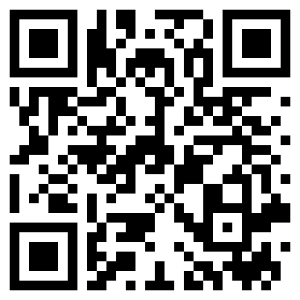

# AgentMeter

### AI 额度状态,抬腕即见。

[English](README.md) · **中文**

---

你离开键盘时,后台的 coding agent 还在烧额度。**AgentMeter** 把 Claude Code 和 Codex 的额度状态放到你 2 秒就能看到的地方——Apple Watch 表盘。当前 **5 小时窗口**和**每周窗口**还剩多少、各自什么时候重置,一眼看清,不用回去翻终端。

## 下载

**[⬇️ 下载 Mac 版 AgentMeter(.dmg)](https://github.com/dothinkerlab/AgentMeter/releases/latest/download/AgentMeter.dmg)**

Mac app 已 Developer ID 签名并通过 Apple 公证——双击即可打开。把 **AgentMeter.app** 拖进「应用程序」,首次启动会请求读取本机 Claude Code 和 Codex 凭据的权限。历史版本见 [Releases 页面](https://github.com/dothinkerlab/AgentMeter/releases)。

**[在 App Store 下载 AgentMeter](https://apps.apple.com/app/id6781480047)**

> iPhone + Apple Watch app 通过 App Store 发布。Mac app 只以这个公证 DMG 分发——因为它需要读取这些工具的 Keychain 凭据,无法在 App Store 沙盒里运行。

## 截图

<table>
  <tr>
    <td align="center" valign="center"></td>
    <td align="center" valign="center"></td>
    <td align="center" valign="center"></td>
  </tr>
  <tr>
    <td align="center"><b>Apple Watch</b></td>
    <td align="center"><b>iPhone</b></td>
    <td align="center"><b>Mac 菜单栏</b></td>
  </tr>
</table>

## 工作原理

1. 一个轻量的 **Mac 菜单栏伴侣 app** 读取你本机已有的 Claude Code 和 Codex 凭据,在你的 Mac 上用它们查询各工具额度。
2. 它把**清洗后的额度快照**经由**你自己的**私有 iCloud 同步——不经过我们的账号或服务器。
3. 你的 **Apple Watch**(和 iPhone)抬腕即可看到剩余百分比和重置时间。

手表和 iPhone 只读到清洗后的快照,从不直连 Anthropic 或 OpenAI。

## 隐私

- 你的 OAuth token 只留在 **Mac Keychain** 里。AgentMeter 仅在你的 Mac 本机用它调用 Claude Code / Codex 的官方端点——**绝不发给我们,也绝不写入 iCloud**。
- 只有**清洗后的额度快照**(数字 + 重置时间)会同步,且只走**你自己的私有 iCloud**。
- 数据无法刷新时,AgentMeter 会明确标记为**陈旧**,而不是显示一个误导性的数值。

## 系统要求

- **Mac 伴侣 app:** macOS 13 及以上(上方公证 DMG)。
- **iPhone + Apple Watch app:** [App Store](https://apps.apple.com/app/id6781480047)。
- Mac 上已登录的 Claude Code 或 Codex 订阅。

---

AgentMeter 当前支持 **Claude Code** 和 **Codex**,更多工具在规划中。

© 2026 dothinker lab · [Releases](https://github.com/dothinkerlab/AgentMeter/releases)

---

## 从源码构建

本仓库同时包含 Mac 菜单栏伴侣(`AgentMeterMac`)与共享核心(`AgentMeterCore`)的源码。跑核心单测:`cd Packages/AgentMeterCore && swift test`;或用 [XcodeGen](https://github.com/yonsm/XcodeGen) 构建 app:`xcodegen generate && open AgentMeter.xcodeproj`。

仓库里的 `DEVELOPMENT_TEAM` 和 iCloud 容器 ID 是维护者本人的。如果你 fork,请在 [`project.yml`](project.yml) 和 [`AgentMeterMac/AgentMeterMac.entitlements`](AgentMeterMac/AgentMeterMac.entitlements) 里改成你自己的 Apple Developer Team 和 CloudKit 容器。

## 许可证

[MIT](LICENSE.md) © 2026 dothinker lab。

---

## 免责声明

AgentMeter 从 Claude Code 与 Codex 的**非官方、未公开**端点读取额度数据。这些端点可能随时变动或失效,使用它们可能受各自服务商的服务条款约束——**风险自负**。

AgentMeter 为独立项目,**与 Anthropic、OpenAI 无任何隶属、背书或赞助关系**。"Claude"、"Claude Code" 是 Anthropic 的商标;"Codex"、"ChatGPT" 是 OpenAI 的商标;"Apple Watch" 是 Apple Inc. 的商标。所有商标归各自所有者所有。
