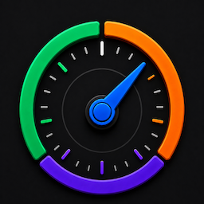
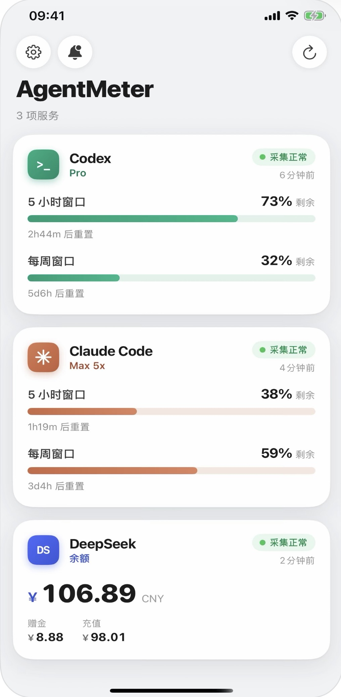
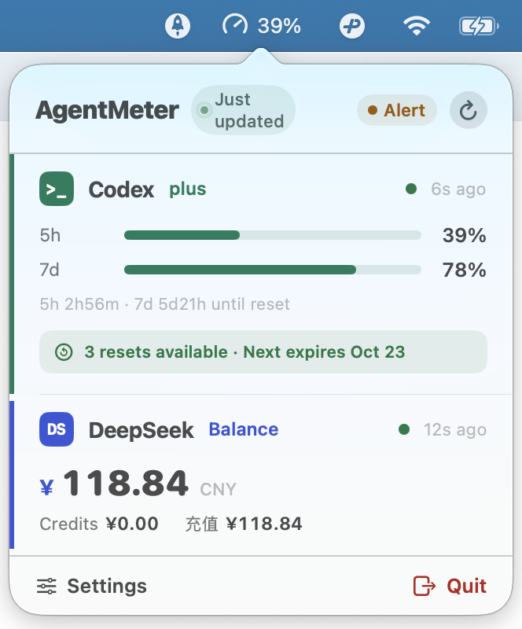
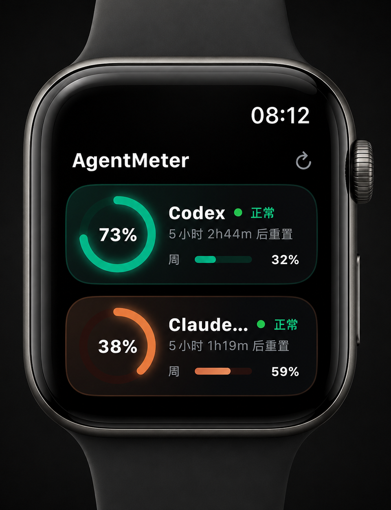

<div align="center">

# AgentMeter

### 把 AI 编程额度放到手腕上。

[English](README.md) · **中文**



[](https://github.com/dothinkerlab/AgentMeter/releases/latest)

</div>


**AgentMeter** 让你在 Mac 菜单栏、iPhone 和 Apple Watch 上随时查看 AI 编程额度、重置时间与 API 账单，离开键盘也能掌握用量。全部功能免费。

## 截图

<table>
  <tr>
    <td align="center" valign="center"></td>
    <td align="center" valign="center"></td>
    <td align="center" valign="center"></td>
  </tr>
  <tr>
    <td align="center"><sub><b>iPhone</b></sub></td>
    <td align="center"><sub><b>Mac 菜单栏</b></sub></td>
    <td align="center"><sub><b>Apple Watch</b></sub></td>
  </tr>
</table>

## 安装与快速开始

### 1. 安装 AgentMeter

Mac 版需要 **macOS 13 或更高版本**，已使用 Developer ID 签名并通过 Apple 公证。

| 平台 | 下载 |
| --- | --- |
| Mac | [下载已公证的 DMG](https://github.com/dothinkerlab/AgentMeter/releases/latest/download/AgentMeter.dmg)，将 **AgentMeter.app** 拖入「应用程序」 |
| iPhone 和 Apple Watch | [在 App Store 下载](https://apps.apple.com/app/id6781480047) |

也可以通过 Homebrew 安装 Mac 版：

```sh
brew install --cask dothinkerlab/tap/agentmeter
```

升级已通过 Homebrew 安装的版本：

```sh
brew upgrade --cask dothinkerlab/tap/agentmeter
```

历史版本见 [Mac Releases 页面](https://github.com/dothinkerlab/AgentMeter/releases)。Mac 伴侣应用需要访问编程工具已有的本机凭据，因此在 App Store 之外分发。


#### 🎁 Agent Meter 专属优惠

领取 **AgentMeter** 的 App Store 专属优惠。

**优惠码：** `AGENTMETER202609`

[👉 前往 App Store 兑换](https://apps.apple.com/redeem?ctx=offercodes&id=6781480047&code=AGENTMETER202609)

优惠通过 Apple 官方 App Store 安全兑换。

> 优惠是否可用及兑换资格，以 Apple App Store 规则和本次优惠条款为准。

### 2. 配置服务商

从 Mac 菜单栏打开 AgentMeter。使用 **Claude Code、Codex、Cursor、Windsurf、JetBrains AI 或 Zed** 时，先在 Mac 上登录或使用对应工具；只有在你显式启用服务商后，AgentMeter 才会读取已有的本机凭据或额度缓存。GitHub Copilot 需要在设置中粘贴 GitHub Token。其他编程套餐和 API 账单服务也可在设置中配置，只需启用你使用的服务。

手动输入的凭据仅保存在当前设备。如果在 Mac 和 iPhone 上都配置了某个服务，需要在各设备分别输入凭据。特殊凭据要求见[支持的服务](#支持的服务)。

### 3. 查看额度

在 Mac 菜单栏查看剩余额度与重置时间。如果需要在 iPhone 和 Apple Watch 上查看编程套餐额度，请在这些设备上使用**同一个 Apple ID** 并开启 iCloud。iCloud 用于跨设备同步额度；API 账单保留在采集数据的设备上。

## 功能概览

- **随时查看额度**：支持 Mac 菜单栏、iPhone 状态页和 Apple Watch 表盘组件。
- **适配服务商周期**：展示滚动窗口、每周限额和月度周期，以及 Codex 重置额度（reset credits）可用数量与到期提醒。
- **本地 API 账单**：根据服务商支持情况，展示余额、限额和日、周、月成本。
- **Mac 管理功能**：搜索服务商，管理凭据与地区，暂停采集，自定义服务显示与排序。
- **明确的数据状态**：刷新失败时标记数据已过期；最新数据表明 5 小时窗口耗尽时，可选择接收重置提醒。

## 支持的服务

| 数据类型 | 服务商 | 配置方式 |
| --- | --- | --- |
| 编程套餐额度 | Claude Code、Codex、Cursor | 使用 Mac 上已有的登录 |
| 编程套餐额度 | GitHub Copilot | GitHub Token，保存在本机 Keychain |
| 编程套餐额度 | Windsurf、JetBrains AI、Zed | 显式启用后检测 Mac 上已有的登录或本地额度缓存 |
| 编程套餐额度 | Kimi Code、GLM Coding Plan、MiniMax Token Plan | 在 Mac 或 iPhone 的服务商设置中配置 |
| 本地 API 余额与账单 | DeepSeek、OpenRouter、Kimi API | 在各设备配置服务商凭据 |
| 本地 API 成本 | OpenAI API、Anthropic API | 使用有权查看组织级成本的凭据 |
| 本地 API 账单 | xAI API | Management Key 和 Team ID |
| 余额与用量（可选 Mac → iPhone 同步） | TypeSafe API（Jev） | Chrome 控制台会话（默认 Auto）或完整 Cookie header（Manual） |
| 仅限 Mac 的团队账单 | Cursor Team | Team/Enterprise Admin API key |

可用指标取决于服务商。OpenAI API 和 Anthropic API 成本指开发者 API 用量，不是 ChatGPT 或 Claude 网页端、应用端的订阅用量。编程套餐额度可通过私有 iCloud 同步；**API 账单默认不进入 CloudKit；Jev 可显式开启显示数据同步**，Cursor Team 成员身份与金额仅保留在 Mac 上。

### TypeSafe API（Jev）Mac 接入

TypeSafe 默认关闭，登录来源默认 Auto。启用后只读所选 Chrome 配置中的 TypeSafe 会话；首次连接可能请求 Chrome Safe Storage 钥匙串授权，后台刷新不会弹窗。多个 Chrome 配置可在设置中选择，会话过期后不会自动切换账号。

Manual 可粘贴 [TypeSafe 官方账单页](https://console.typesafe.ai/settings/billing) 已登录请求的完整 Cookie header，保存在本机 Keychain；普通推理 API key 无法替代登录会话。两种来源不互相回退，可暂停、重新连接或删除手动 Cookie。

余额、账单页周期消费、有效 Credit 的余额与到期日期，以及今日、最近 7 天、本月 Token 和本月请求数默认仅在 Mac 展示；在一台 Mac 开启“同步 Jev 到 iCloud”后，可通过相同 Apple ID 提供给 iPhone、Widget 和 Watch。账单页消费与 Token 用量口径不同，历史覆盖范围未知，数据可能延迟；到期时间不是额度重置时间。Auto Cookie 仅保留在内存，凭据不进入 iCloud；仅显式开启的 Jev 显示数据可进入私有 CloudKit。凭据和账单数值不进入日志或诊断。控制台接口未公开，可能变化或要求浏览器验证；采集不调用推理接口。

## 隐私与同步

每台采集设备使用自己的本机凭据查询服务商。AgentMeter 不会将这些凭据发送给我们，也不会写入 iCloud。

- **已有的 Mac 登录**：Claude Code 凭据从 Keychain 读取；Codex 优先读取 Keychain，找不到条目时读取 `~/.codex/auth.json`；Cursor 与 Windsurf 数据库和 JetBrains AI 额度文件均以只读方式打开；Zed 凭据只从同源的本机 Keychain 项目读取，AgentMeter 不刷新或修改这些凭据。
- **手动输入的凭据**：存入本机 Keychain，关闭 iCloud Keychain 同步及通过备份迁移至其他设备的能力。
- **私有额度同步**：仅将经过清理的编程套餐状态写入你的私有 CloudKit 数据库，例如额度窗口、重置时间、订阅档位、重置额度可用数量与数据更新状态；不包含服务商凭据或上游重置额度 ID。
- **本地账单**：账单记录默认保留在采集设备上；Jev 显示数据可显式开启私有云同步。Cursor Team 成员身份与金额只留在持有 Admin API key 的 Mac 上。
- **设备访问范围**：Apple Watch 读取已同步的额度，不接收服务商令牌，也不直连服务商；iPhone 只查询你在该设备上明确配置的服务商。

刷新失败时，应用会标记数据已过期。脱敏诊断仅在你主动导出时生成。

## 故障排查与问题反馈

如果各设备显示的额度不一致，请先比较**更新时间**，并检查是否使用同一个 Apple ID 开启了 iCloud。

1. 在 Mac 打开**设置 → 关于 AgentMeter → 导出脱敏诊断**，或在 iPhone 打开**设置 → App 信息**导出诊断。
2. 打开 [Bug Report 表单](https://github.com/dothinkerlab/AgentMeter/issues/new?template=bug_report.yml)。
3. 填写复现步骤、各受影响设备的更新时间，并附上诊断文件。

诊断包含应用与系统版本、额度与重置状态、更新时间、本地账单服务状态和待写入 CloudKit 的项目；不包含凭据、Keychain 内容、设备名称、原始日志、服务商原始响应或账单金额。提交前请检查你额外添加的截图和文字。

## 从源码构建

本仓库包含 **macOS 伴侣应用**（`AgentMeterMac`）和**共享核心包**（`AgentMeterCore`）。iPhone 与 Apple Watch 应用通过 App Store 分发，其源码不包含在本仓库中。

前置条件：包含 **Swift 6.2 或更新工具链**的 Xcode，以及用于生成 Xcode 工程的 **XcodeGen**。以下命令均从仓库根目录执行。

运行核心测试：

```sh
swift test --package-path Packages/AgentMeterCore
```

生成并打开 Xcode 工程：

```sh
xcodegen generate
open AgentMeter.xcodeproj
```

选择 **AgentMeterMac** scheme，构建并运行 Mac 应用。

仓库中的签名团队与 iCloud 容器属于维护者。构建自己的版本时，请先在 [`project.yml`](project.yml) 中设置自己的 Apple Developer Team，在 [`AgentMeterMac/AgentMeterMac.entitlements`](AgentMeterMac/AgentMeterMac.entitlements) 中设置自己的 CloudKit 容器，再生成工程。你自己的容器与 App Store 应用使用的容器相互独立。

## 维护者发布验收

每次公开发布 Mac 新版，都必须与通过 TestFlight 安装的实际 iPhone 构建完成 [Mac + iPhone 联合发布检查清单](docs/RELEASE_CHECKLIST.zh-CN.md)，包括 CloudKit Production Schema 检查，以及从最终下载 DMG 安装后的真包测试。

## 许可证

[MIT](LICENSE.md) © 2026 dothinker lab。

## 免责声明

AgentMeter 从 Claude Code、Codex、GitHub Copilot 与 [Cursor Dashboard](https://github.com/Noisemaker111/openusage-opencode/blob/main/docs/providers/cursor.md) 的**非官方、未公开**端点，以及 Windsurf、JetBrains AI 的本地缓存格式和 Zed 客户端 API 读取额度数据，这些接口可能随时变动或失效。Copilot 当前要求手工提供 Token，不支持 GitHub Enterprise；Cursor Team 使用 Cursor [官方 Admin API](https://docs.cursor.com/en/account/teams/admin-api)，并要求管理员创建 key。其他集成使用各服务商 API，也可能发生变化。使用这些服务可能受各自服务商的服务条款约束，请自行承担风险。

AgentMeter 为独立项目，**与文中列出的任何服务商均无隶属、背书或赞助关系**。所有服务商与产品名称均为各自权利人的商标。
